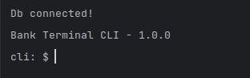

# Bank Terminal CLI

[](https://github.com/kwameopareasiedu)


A simple banking terminal CLI in C backed by a PostgreSQL database.

### Features

| Feature         | Description                                       |
|-----------------|---------------------------------------------------|
| Register        | Register a new user in the database               |
| Authentication  | Authenticate the user using an email and password |
| Check balance   | Check the remaining balance in database           |
| Withdraw money  | Withdraw money from account without overdraft     |
| Account details | Display account information                       |
| Add funds       | Add funds to account                              |

### Build Source

To run the project, you'll first need to build it. For that we'll need the following installed:

- CMake (version 3.22.1 or higher)
- PostgreSQL database
- PostgreSQL development libraries (`libpq-dev`)
  > Install with `sudo apt install libpq-dev`

Build the targets using the following steps:

1. Clone the project `git clone git@github.com:kwameopareasiedu/bank-terminal-cli.git`
2. Navigate to the project root `cd bank-terminal-cli`
3. Create a `build` folder and navigate to it `mkdir build && cd build`
4. Run cmake to create the makefile `cmake ..`
5. Run the make file to build the executables `make`

### Database Setup

After building the targets in the previous section, you should have 2 executables in the `build` folder

- `db_setup`
- `bank_terminal_cli`

1. Open your database client (pgadmin, dbeaver, etc) and create a new database
2. Back in the `build` folder, create a text file called **`conf`** (no extension)
3. Paste the following in and replace with your own config:
   ```text
    name=NAME_OF_DATABASE
    user=DATABASE_USER
    pass=DATABASE_PASSWORD
    host=DATABASE_HOST
    port=DATABASE_PORT
    ```
4. Run the `db_setup` to create the tables, function and trigger `./db_setup`
5. Verify that the following were created in the database:
    - `users` table
    - `records` table
    - `fn_update_updated_at` function

### Running the app

With our database setup, run the app using `./bank_terminal_cli`. You should see this in your console output:

